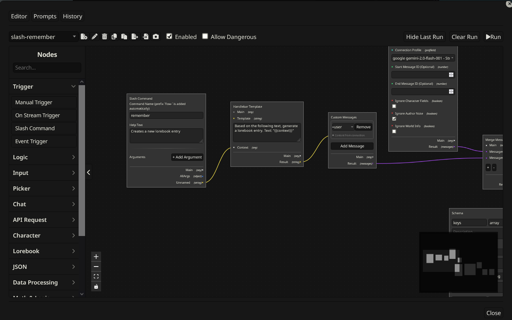
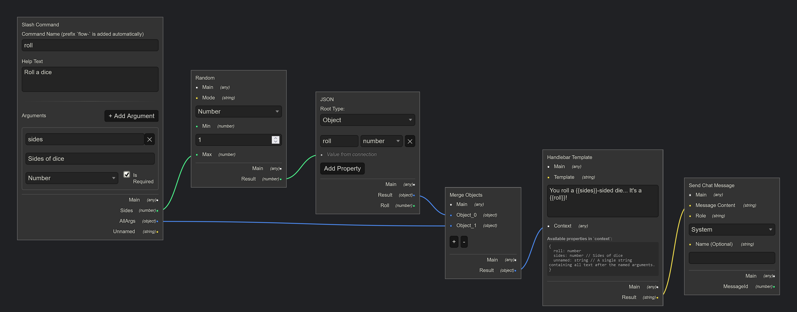
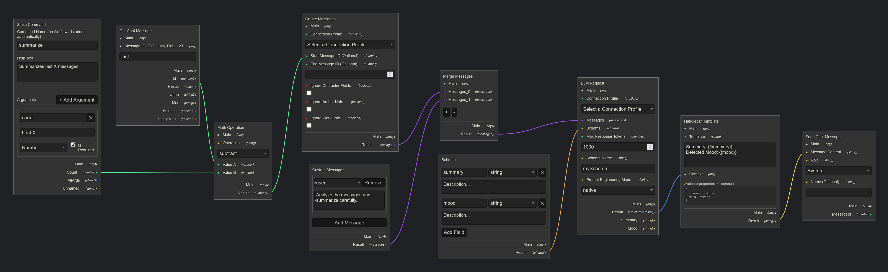
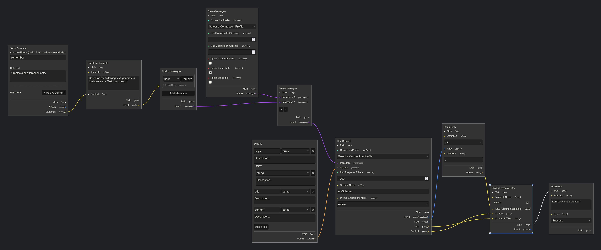
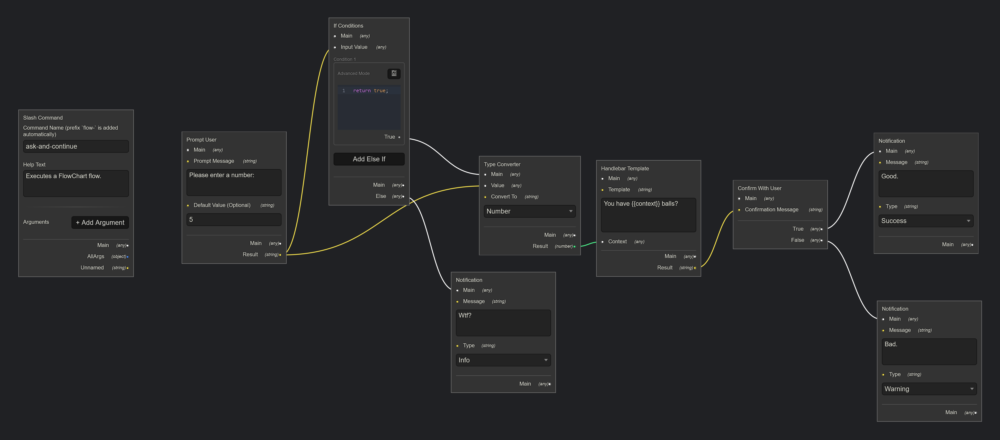
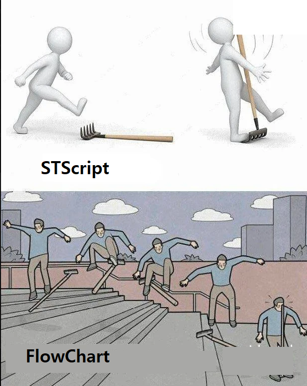

## Flowchart

### What is Flowchart?

Flowchart is a powerful extension for [SillyTavern](https://docs.sillytavern.app/) that allows you to automate actions, create custom commands, and build complex logic using a visual, node-based editor. Instead of writing STScript, you connect blocks (nodes) together to create a "flow" that runs when certain events happen.

You can use it to:

*   Automatically react to messages (e.g., if the user says "remember this", create a lorebook entry).
*   Create complex, multi-step slash commands.
*   Modify chat messages on the fly.
*   Interact with an LLM for structured data extraction (e.g., "summarize the last 5 messages into bullet points").
*   Automate character and lorebook management.
*   Replace your STScript usage with a visual interface.

### Showcase

<details>
  <summary>Overview</summary>

  

</details>

<details>
  <summary>Roll Command</summary>

  

</details>

<details>
  <summary>Summarize Command</summary>

  

</details>

<details>
  <summary>Remember Command</summary>

  

</details>

<details>
  <summary>Ask And Confirm Command</summary>

  

</details>

<details>
  <summary>Bonus</summary>

  

</details>

### Installation

Install via the SillyTavern extension installer:

```txt
https://github.com/bmen25124/SillyTavern-Flowchart
```

### Core Concepts

*   **Nodes:** The building blocks of your flow. Each node performs a specific action, like creating a string, checking a condition, or sending a message.
*   **Handles:** The circles on the left (inputs) and right (outputs) of nodes. You drag connections between them.
*   **Connections (Wires):** Lines that connect an output handle of one node to an input handle of another. This defines the order of operations and the flow of data.

#### Control Flow vs. Data Flow (`main` Handle)

There are two types of connections:

*   **Data Flow:** Connecting a specific output (e.g., `value`, `result`) to an input. This sends a piece of data for the next node to *use*. For example, connecting a `String` node's `value` output to a `Log` node's `value` input tells the `Log` node *what* to print.
*   **Control Flow:** Connecting the special `main` handle. This defines the *order* of operations. Most nodes that perform an action have a `main` input and a `main` output. The `main` channel also "passes through" whatever value it receives, allowing you to carry a result through a series of utility nodes that don't modify it.

In short: named handles are for *what* a node does; the `main` handle is for *when* it does it.

### Dangerous Nodes

Some nodes, like `Execute JS Code` and `HTTP Request`, can be dangerous. They can run arbitrary code or communicate with external services. For security, these nodes will not run unless you explicitly enable the **"Allow Dangerous"** toggle for that specific flow in the toolbar. Only enable this for flows you have created yourself or fully trust.

### Keyboard Shortcuts

*   **Copy:** `Ctrl/Cmd + C` - Copies selected node(s).
*   **Paste:** `Ctrl/Cmd + V` - Pastes copied node(s) to the center of the view.
*   **Undo:** `Ctrl/Cmd + Z` - Undoes the last action.
*   **Redo:** `Ctrl/Cmd + Y` - Redoes the last undone action.
*   **Delete:** `Delete` or `Backspace` - Deletes selected node(s) or edge(s).
*   **Toggle Disable:** `Space` - Disables or enables selected node(s). A disabled node is skipped during execution.

### Node Reference

#### **Trigger Nodes**

*   **Event Trigger:** Starts a flow when a SillyTavern event occurs (e.g., a user message is sent). This is the primary way to create automations. For a full list of events, see the [Event Documentation](EVENT_DOCUMENTATION.md).
*   **Manual Trigger:** Starts a flow only when you click the "Run" button in the editor. Useful for testing.
*   **Slash Command:** Creates a new `/flow-<name>` slash command that triggers the flow and passes arguments to its output handles.
*   **Menu Trigger:** Adds a custom button to the main "Extensions" menu that triggers the flow when clicked.
*   **Message Toolbar Trigger:** Adds a custom button to the toolbar on every chat message.
*   **QR Button Trigger:** Adds a button to the Quick Reply bar. Buttons are arranged into rows by `group`, and sorted within each row by `order`. The order of the groups themselves is configured in the "QR Groups" tab of the popup.
*   **On Stream Trigger:** A special trigger for "handler" flows. It starts a flow that is called repeatedly for each piece of data from an `LLM Request` node's stream. It provides `chunk` (the newest text) and `fullText` (all text received so far).

#### **Logic Nodes**

*   **If:** Directs the flow based on one or more conditions. If a condition is true, the flow continues from that condition's output. If none are true, it continues from the "Else" output.
*   **End Flow:** Immediately stops the flow's execution.

#### **Input Nodes**

*   **String:** Creates a static string of text.
*   **Number:** Creates a static number.
*   **Boolean:** Creates a static true/false value.
*   **Profile ID:** A dropdown to select one of your API Connection Profiles.

#### **Picker Nodes**
These nodes provide dropdowns to select a specific item, which can then be passed to other nodes.
*   **Pick Character:** Outputs the selected character's avatar filename.
*   **Pick Lorebook:** Outputs the selected lorebook's name.
*   **Pick Prompt:** Outputs the name of a saved custom prompt template.
*   **Pick Flow:** Outputs the selected flow's ID.
*   **Pick Regex Script:** Outputs the ID of a SillyTavern regex script.
*   **Pick Math Operation:** Outputs an operation name (add, subtract) for the `Math` node.
*   **Pick String Operation:** Outputs an operation name for the `String Tools` node.
*   **Pick Prompt Mode:** Outputs a prompt engineering mode (native, json, xml) for the `LLM Request` node.
*   **Pick Random Mode:** Outputs a mode (number, array) for the `Random` node.
*   **Pick Regex Mode:** Outputs a mode (sillytavern, custom) for the `Regex` node.
*   **Pick Conversion Type:** Outputs a target type (string, number) for the `Type Converter` node.

#### **Chat Nodes**

*   **Send Chat Message:** Sends a new message to the current chat as the user, assistant, or system.
*   **Get Chat Message:** Retrieves details of a specific message from the chat history.
*   **Edit Chat Message:** Modifies the content of an existing message.
*   **Remove Chat Message:** Deletes a message from the chat history.
*   **Hide/Show Message (Context):** Toggles whether a message or range of messages is included in the LLM's context. Does not affect visibility in the UI.
*   **Get Chat Input:** Retrieves the text from the main chat input field.
*   **Update Chat Input:** Sets the text in the main chat input field.

#### **API Request Nodes**

*   **Create Messages:** Gathers the current chat context (system prompt, history, etc.) to prepare it for an LLM request.
*   **Custom Message:** Builds a list of messages from scratch, ignoring the current chat context.
*   **LLM Request:** Sends messages to an LLM. Can be a simple text response or a structured JSON/XML response if a Schema is provided. Supports a **Stream** option for simple text, which can call another flow for each token received (see `On Stream Trigger`).
*   **Merge Messages:** Combines multiple lists of messages into a single list.
*   **HTTP Request:** (Dangerous) Makes requests to any external API.

#### **Character Nodes**

*   **Get Character:** Retrieves all information about a specific character.
*   **Create Character:** Creates a new character.
*   **Edit Character:** Modifies an existing character's details.

#### **Lorebook Nodes**

*   **Get Lorebook:** Retrieves all entries from a specified lorebook.
*   **Get Lorebook Entry:** Retrieves a single entry from a lorebook.
*   **Create Lorebook:** Creates a new, empty lorebook.
*   **Create Lorebook Entry:** Adds a new entry to a lorebook.
*   **Edit Lorebook Entry:** Modifies an existing lorebook entry.

#### **JSON & Schema Nodes**

*   **JSON:** A visual editor to construct a JSON object. Each key in the object gets its own output handle.
*   **Schema:** A visual editor to define the *structure* of data you expect from an LLM. Connect this to an `LLM Request` node to force the AI to respond in a specific format.
*   **Variable Schema:** Defines a schema to validate a single variable. Attach it to any `Get ... Variable` node to enforce the returned value's type.

#### **Utility Nodes**

*   **Log:** Prints any connected data to your browser's developer console (F12). Essential for debugging.
*   **Date/Time:** Gets the current date and time in various formats.
*   **Handlebar:** A templating tool. Create a template like "Hello, {{name}}!" and provide an object to fill in the values.
*   **Math:** Performs basic arithmetic operations (add, subtract, etc.).
*   **Merge Objects:** Combines multiple objects into a single one. Keys from later inputs overwrite earlier ones.
*   **Note:** A visual-only node for adding comments and documentation to your flow. It is ignored during execution.
*   **Random:** Generates a random number in a range or picks a random item from an array.
*   **Regex:** Applies a regular expression to find/replace text. Can use SillyTavern's built-in regex scripts or a custom one.
*   **Run Slash Command:** Executes any built-in SillyTavern slash command.
*   **Run Flow:** Triggers another flow, allowing for reusable logic.
*   **String Tools:** A collection of functions to manipulate text (e.g., `toUpperCase`, `split`, `replace`).
*   **Type Converter:** Converts data from one type to another (e.g., a string of text to a number).
*   **Execute JS Code:** (Dangerous) Runs arbitrary JavaScript code.

#### **Variables Nodes**

*   **Set/Get Flow Variable:** Stores data temporarily for the current execution of a single flow.
*   **Set/Get Local Variable:** Reads/writes SillyTavern chat-local variables (per-chat persistence).
*   **Set/Get Global Variable:** Reads/writes SillyTavern global variables (persistent across all chats).
*   **Get Property:** Pulls a specific piece of data out of an object using a path (e.g., `user.name`).

#### **User Interaction Nodes**

*   **Notification:** Displays a toast notification in the SillyTavern UI (info, success, warning, error).
*   **Prompt User:** Shows a popup to get text input from the user during a flow run.
*   **Confirm With User:** Shows a popup with "OK/Cancel" to get a yes/no confirmation from the user.

### Simple Example: Reacting to a Keyword

Let's create a simple flow where the character says "Ouch!" whenever the user's message contains the word "poke".

**Diagram:**
`[Event Trigger]` -> `[Get Chat Message]` -> `[If]` -> `[Send Chat Message]`

**Steps:**

1.  **Drag an "Event Trigger" node.** Set its "Event" dropdown to `user_message_rendered`. This node will start the flow every time you send a message. It outputs the `messageId` of your new message.
2.  **Drag a "Get Chat Message" node.** Connect the `messageId` output from the trigger to the `messageId` input of this node. This will fetch the content of the message you just sent.
3.  **Drag an "If" node.** Connect the `mes` (message content) output from "Get Chat Message" to the **"Input Value"** input handle of the "If" node.
4.  **Configure the "If" node.**
    *   Set the operator dropdown to `contains`.
    *   In the value box, type `poke`.
5.  **Drag a "Send Chat Message" node.** In its "Message Content" box, type `Ouch!`.
6.  **Connect the flow.** Drag a wire from the "True" output of the "If" node to the `main` input of the "Send Chat Message" node.

That's it! Now, any time you send a message containing "poke", the character will automatically respond with "Ouch!".
